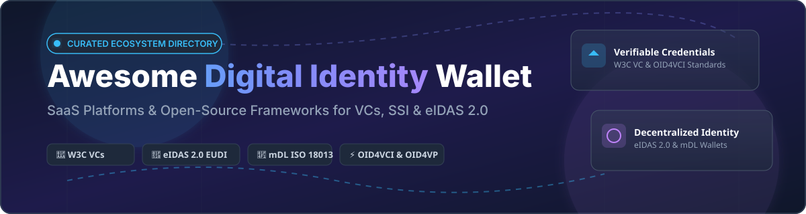

# 🌐 Awesome Digital Identity Wallet 🪪

    

## 🚀 Top Digital Identity Wallet Ecosystem & Infrastructure

**A Curated List of SaaS Platforms & Open-Source GitHub Projects for Verifiable Credentials (VCs), Self-Sovereign Identity (SSI), Mobile Driving Licenses (mDL), OpenID for Verifiable Credentials (OID4VCI / OID4VP) & eIDAS 2.0 European Digital Identity Wallets (EUDI).**

*Last updated: October 2026*

---

## 🔍 Overview & Market Context

This repository tracks notable **SaaS platforms** and **open-source projects** for **Digital Identity Wallets**. These solutions allow users to securely store and present W3C Verifiable Credentials (VCs), Mobile Driving Licenses (mDLs, ISO/IEC 18013-5), and identity attestations without oversharing sensitive personal data.

### 📊 Market Size & Industry Structure Analysis
> 📈 **Global Digital Identity Market Size:** Estimated at **$34.5 Billion in 2024** and projected to surpass **$85+ Billion by 2030** (growing at a CAGR of ~16.2%), catalyzed by the European Union's **eIDAS 2.0 mandate** requiring member states to offer EUDI wallets to citizens.  
> 🧩 **Market Fragmentation:** The sector is currently **highly fragmented**. While tech giants like Microsoft (Entra ID) and defense/security giants like IDEMIA command enterprise and government segments, no single provider controls the market. Regional regulatory frameworks (eIDAS 2.0 in Europe, NIST/mDL standards in the US) and competing protocols (Aries/DIDComm vs. OID4VC) keep the industry split between commercial trust frameworks and modular open-source stacks.

---

## 📑 Table of Contents

- [🏢 SaaS & Hosted Platforms](#-saas--hosted-platforms)
- [🔓 Open-Source GitHub Projects](#-open-source-github-projects)
- [🤝 How to Contribute](#-how-to-contribute)
- [💖 Support & Sponsorship](#-support--sponsorship)
- [📈 Star History](#-star-history)
- [⚠️ Disclaimer](#%EF%B8%8F-disclaimer)

---

## 🏢 SaaS & Hosted Platforms

*(Sorted descending by Company Size / Market Valuation / Funding)*

| Platform | Description | Company Size / Revenue / Valuation | Starting Pricing | Free Tier / Trial Limits |
| :--- | :--- | :--- | :--- | :--- |
| **[Microsoft Entra Verified ID](https://www.microsoft.com/en-us/security/business/identity-access/microsoft-entra-verified-id)** 🏢 | Enterprise platform for issuing and verifying W3C verifiable credentials at scale. | **$3.81 Trillion** (Market Cap) | Included with Microsoft Entra ID P1 subscription ($6.00/user/month) after free allocation. | Free up to 50,000 transactions per month (issuance, verification, or revocation). |
| **[IDEMIA Mobile ID](https://www.idemia.com/)** 🛡️ | Government and enterprise mobile driving license (mDL) and digital ID ecosystem provider. | **~$3.19 Billion** (Funding / ~€2.9B Revenue) | Custom government contract pricing based on enrollment scale. | SDK developer portal sandbox access provided for government pilot testing. |
| **[Dock Labs (Truvera)](https://dock.io/)** ⚓ | Verifiable credential and digital identity infrastructure platform. | **~$1.5 Billion** (Valuation / $280M+ Ecosystem Funding) | Build/Starter plan at $499/month for small production use cases. | 30-day free trial with unlimited issuance and verification in test environment. |
| **[OneSpan Identity Wallet](https://www.onespan.com/)** 🔒 | High-assurance identity verification and eIDAS 2.0 wallet integration framework. | **~$650 Million** (Market Cap - NASDAQ: OSPN) | DigipassONE enterprise tier quote-based contract. | 30-day trial sandbox for developer API and eSignature integration evaluation. |
| **[Yoti Wallet](https://www.yoti.com/)** 🔑 | High-assurance consumer digital identity wallet and age verification platform. | **~$116 Million** (Funding / ~$45M Revenue) | Custom enterprise contract pricing per verification check. | Free end-user mobile app download; developer sandbox access for integration testing. |
| **[Spruce ID](https://spruceid.com/)** 🌲 | Enterprise and government-focused SSI and mobile driving license (mDL) platform. | **~$40 Million** (Venture Funding Raised) | Enterprise quote-based commercial licensing. | Free open-source core libraries (Rust SSI toolkit) and sandbox environment for testing. |
| **[Trinsic](https://trinsic.id/)** ⚡ | Infrastructure for verifiable credentials and digital identity wallet acceptance. | **~$13.7 Million** (Venture Funding Raised) | Pay-as-you-go live production verification pricing (Contact sales for rates). | Free developer test environment with mock providers and demo profiles (no per-transaction fee). |
| **[Lissi](https://lissi.id/)** 🇪🇺 | European digital identity wallet specialist for eIDAS 2.0 and enterprise SSI. | **~$3.8 Million** (€3.5M Venture Funding / Spin-off of Commerzbank's neosfer) | Commercial licensing via EUDI Wallet Starter Program. | Free test network access and developer sandbox for testing OID4VCI/OID4VP protocols. |
| **[Validated ID (VIDidentity)](https://www.validatedid.com/)** 📑 | Sovereign digital identity and eIDAS-compliant credential verification service. | **~$2.6 Million** (Funding / Acquired by Signaturit Group) | Enterprise contract pricing tailored by annual volume. | 14-day free trial for developer portal integration and testing APIs. |
| **[Affinidi](https://affinidi.com/)** 🌐 | Developer-focused SSI and verifiable credential login and data exchange platform. | **Undisclosed** (Backed by Temasek / LemmaTree) | Developer pay-as-you-go based on active usage beyond free credits. | Free portal registration with included developer credits and unlimited sandbox project testing. |

---

## 🔓 Open-Source GitHub Projects

*(Sorted descending by GitHub Stars_Count)*

| Repository / Project | GitHub_Stars | Description | Focus / Stack |
| :--- | :---: | :--- | :--- |
| **[decentralized-identity/universal-resolver](https://github.com/decentralized-identity/universal-resolver)** 🌐 |  | Universal DID resolution infrastructure driver network from Decentralized Identity Foundation. | Java, Docker, W3C DID Resolution |
| **[decentralized-identity/veramo](https://github.com/decentralized-identity/veramo)** ⚡ |  | Open JavaScript/TypeScript framework for verifiable data, DID agents, credentials, and key management. | TypeScript, Node.js, React Native |
| **[openwallet-foundation/credo-ts](https://github.com/openwallet-foundation/credo-ts)** 🛠️ |  | Leading open TypeScript framework for decentralized identity and VCs (successor path from Hyperledger Aries JS). | TypeScript, OWF, Aries |
| **[walt-id/waltid-identity](https://github.com/walt-id/waltid-identity)** 🌿 |  | Holistic open-source identity and wallet toolkit—issuer, verifier, and wallet APIs multi-platform. | Kotlin, Java, OID4VC |
| **[spruceid/ssi](https://github.com/spruceid/ssi)** 🦀 |  | Open Rust core libraries for decentralized identity, W3C VCs, and Decentralized Identifiers. | Rust, WASM, SSI |
| **[eu-digital-identity-wallet/eudi-app-android-wallet-ui](https://github.com/eu-digital-identity-wallet/eudi-app-android-wallet-ui)** 🇪🇺 |  | Official European Digital Identity (EUDI) Wallet Reference Implementation for Android. | Kotlin, Android, eIDAS 2.0 |
| **[openwallet-foundation/bifold-wallet](https://github.com/openwallet-foundation/bifold-wallet)** 📱 |  | Open React Native digital holder wallet reference app built on top of Credo-TS framework. | React Native, Mobile Wallet |
| **[sphereon-opensource/mobile-wallet](https://github.com/sphereon-opensource/mobile-wallet)** 📲 |  | Open-source white-label SSI & OID4VC digital identity mobile wallet application. | React Native, OID4VCI, OID4VP |
| **[hyperledger/aries-cloudagent-python](https://github.com/hyperledger/aries-cloudagent-python)** 🐍 |  | Aries Cloud Agent Python (ACA-Py)—widely used backend agent framework for issuers & verifiers. | Python, Hyperledger Aries |
| **[spruceid/isomdl](https://github.com/spruceid/isomdl)** 🪪 |  | ISO 18013-5 Mobile Driving License (mDL) implementation in Rust for native and mobile devices. | Rust, ISO 18013-5 mDL |

---

### 🧩 Recommended Technical Stacks for Architects
- **📱 Holder Wallet:** Bifold (React Native), Sphereon Mobile Wallet, or walt.id white-label wallet apps.
- **⚙️ Agent Framework:** Credo-TS (TypeScript / Node.js) or ACA-Py (Python).
- **📡 Issuer & Verifier Services:** walt.id Kotlin Suite or Veramo JS Agents.
- **🦀 Native & Rust Integrations:** SpruceID Rust SSI & isoMDL libraries.
- **🇪🇺 European eIDAS Compliance:** EUDI Wallet reference architecture combined with OID4VCI / OID4VP protocols.

---

## 🤝 How to Contribute

We welcome community contributions to keep this list current and comprehensive! 🌟

1. 🍴 **Fork** this repository.
2. 📝 **Add or update** entries in `README.md` following the tabular layout.
3. 🔗 **Include**: Name, repository link, Stars_Badge, 1–2 sentence description, and accurate pricing/star data.
4. 🚀 **Submit a Pull Request** with a brief summary of your changes.

---

## 💖 Support & Sponsorship

Thank you for exploring and building open digital identity systems! 💙 If you find this curated resource helpful for your work, research, or development:

- ⭐ **Star** this repository to show support and increase visibility.
- 🔀 **Fork** and share it with your identity architecture team or community.
- ☕ **Buy me a coffee / Sponsor**: Support ongoing maintenance and open-source contributions via the [GitHub Sponsor Dashboard](https://github.com/sponsors/ishandutta2007).

---

## 📈 Star History

---

## ⚠️ Disclaimer

- This is a **community-curated** educational resource and not an endorsement of any vendor or software.
- Digital Identity Wallets manage high-assurance credentials. Implementations should strictly enforce hardware-backed key protection (e.g., Secure Enclave / StrongBox), minimize personal data disclosure, and adhere to relevant regulations including eIDAS 2.0, GDPR, and ISO/IEC 18013-5 standards.

---

<b>Made with ❤️ for Identity Architects, Government Digital-ID Teams &amp; Decentralized Tech Builders.</b>

